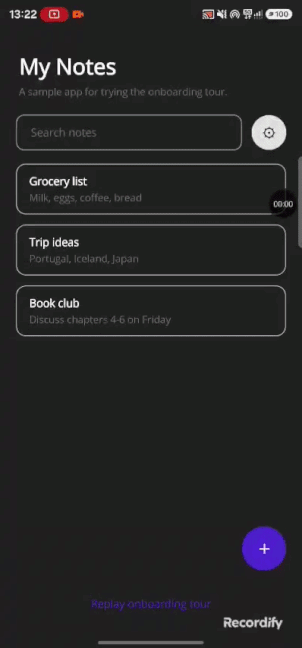

# Plugin.Maui.Onboarding

An app-tour / walkthrough control for .NET MAUI: a dark scrim with a spotlight
hole cut into it, moving from control to control with a tooltip card
explaining each one — the classic "coach mark" first-run tour.



## How it's meant to be used

Mark the controls you want to spotlight with `OnboardingTargetBehavior`:

```xml
<Button Text="Add entry">
    <Button.Behaviors>
        <onboarding:OnboardingTargetBehavior Key="AddEntryButton" />
    </Button.Behaviors>
</Button>
```

Build a tour naming those keys in order, and start it:

```csharp
OnboardingTour tour = OnboardingTourBuilder.Create("FirstRunTour")
    .AddStep(new OnboardingStep
    {
        TargetKey = "AddEntryButton",
        Title = "Add an entry",
        Description = "Tap here to log time for the day.",
        Shape = OnboardingSpotlightShape.Circle
    })
    .Build();

var coordinator = new OnboardingCoordinator();
await coordinator.StartTourIfNotCompletedAsync(tour);
```

`OnboardingCoordinator` is the one type consumers drive directly — it resolves
each step's target bounds, pushes a transparent modal page over the current
Shell content, animates the spotlight between steps, and marks the tour
completed (via `Preferences`) once the user finishes or skips it, so
`StartTourIfNotCompletedAsync` won't show it again. Call `ReplayTourAsync` to
force it to run again regardless of completion state.

Hold one `OnboardingCoordinator` instance for as long as its host page (or a
longer-lived scope, e.g. a DI singleton) is alive — the way the example app
keeps one as a field on `MainPage` — rather than creating and discarding one
per tour. It isn't `IDisposable`; the only thing to actually avoid is
discarding an instance while `IsTourActive` is true, since its overlay would
have no other way to get popped off the navigation stack.

### Customizing colors

The scrim and tooltip card both render with sensible defaults (`#B3000000`
scrim, `#E6000000` tooltip background, transparent tooltip border) out of the
box. Override any of them via `OnboardingCoordinator`, at any time, including
mid-tour:

```csharp
var coordinator = new OnboardingCoordinator
{
    ScrimColor = Colors.Black.WithAlpha(0.8f),
    TooltipBackgroundColor = Color.FromArgb("#1A1A2E"),
    TooltipBorderColor = Color.FromArgb("#3A3A5E")
};
```

Leaving any of them unset (`null`, the default) keeps the built-in default —
for `ScrimColor` specifically, that also means it still falls back to any
`onboarding_scrim_light`/`onboarding_scrim_dark` app resources, the way it did
before this API existed.

### Multi-page tours

A step can set `RequiredRoute` to navigate somewhere before that step's
target is resolved — a tour doesn't have to stay on one page:

```csharp
.AddStep(new OnboardingStep
{
    TargetKey = "ThemeToggle",
    Title = "More settings",
    Description = "Tap here to change your theme.",
    RequiredRoute = "SettingsPage" // Shell.Current.GoToAsync("SettingsPage")
})
```

Steps are grouped into "segments" — a new one starts at the first step and at
every step with a `RequiredRoute`. Each segment's bounds are fully resolved
(navigating first, if needed) *before* the overlay is shown or updated for
it; the overlay briefly hides while a later segment is being resolved. This
exists because resolving bounds for a target still covered by the overlay's
modal can, for some controls, stall indefinitely — so resolution always
happens with the target page fully uncovered, one page at a time.

`TargetKey`s must be unique across the *entire* tour, not just per page —
the target registry is a single process-wide table keyed only by string,
with no page scoping, so reusing a key on two pages silently shadows the
first registration.

## Prerequisites

- A Shell-based app (`OnboardingCoordinator` pushes its overlay via
  `Shell.Current.Navigation`).

## Project structure

```
src/Plugin.Maui.Onboarding/
  OnboardingCoordinator.cs        the entry point — starts/advances/skips a tour
  OnboardingTour.cs, OnboardingTourBuilder.cs, OnboardingStep.cs
  OnboardingTargetBehavior.cs     attach to any VisualElement to make it spotlightable
  OnboardingSpotlightShape.cs, OnboardingTooltipPlacement.cs, OnboardingArrowDirection.cs
  Internals/                      target registry/locator, geometry math, the scrim drawable
  Views/                          the overlay page/view and tooltip card (XAML)
example/Plugin.Maui.Onboarding.Example/   a MAUI app scaffold for trying the library
```

## License

MIT — see [LICENSE](LICENSE).
